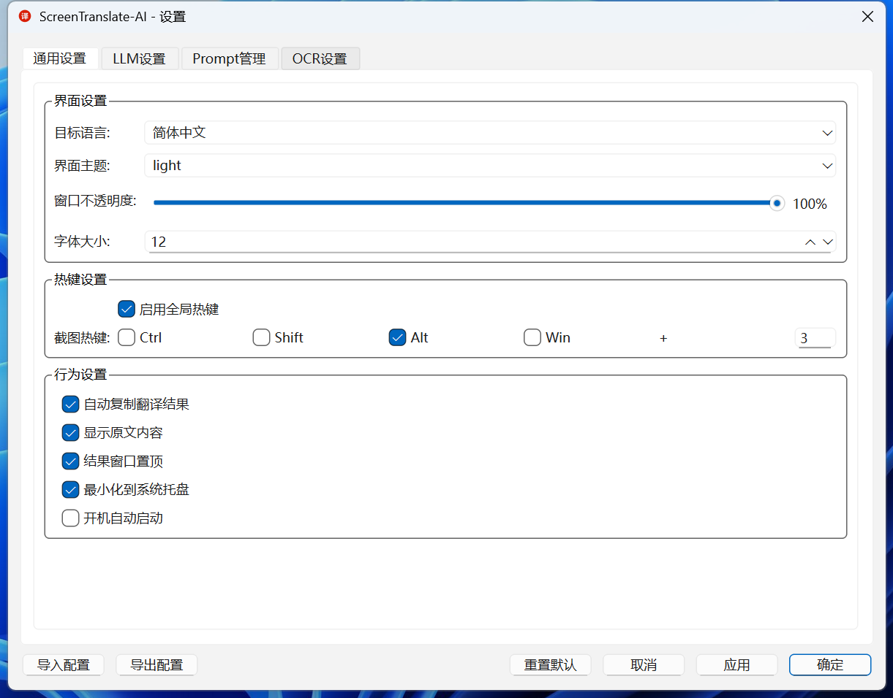
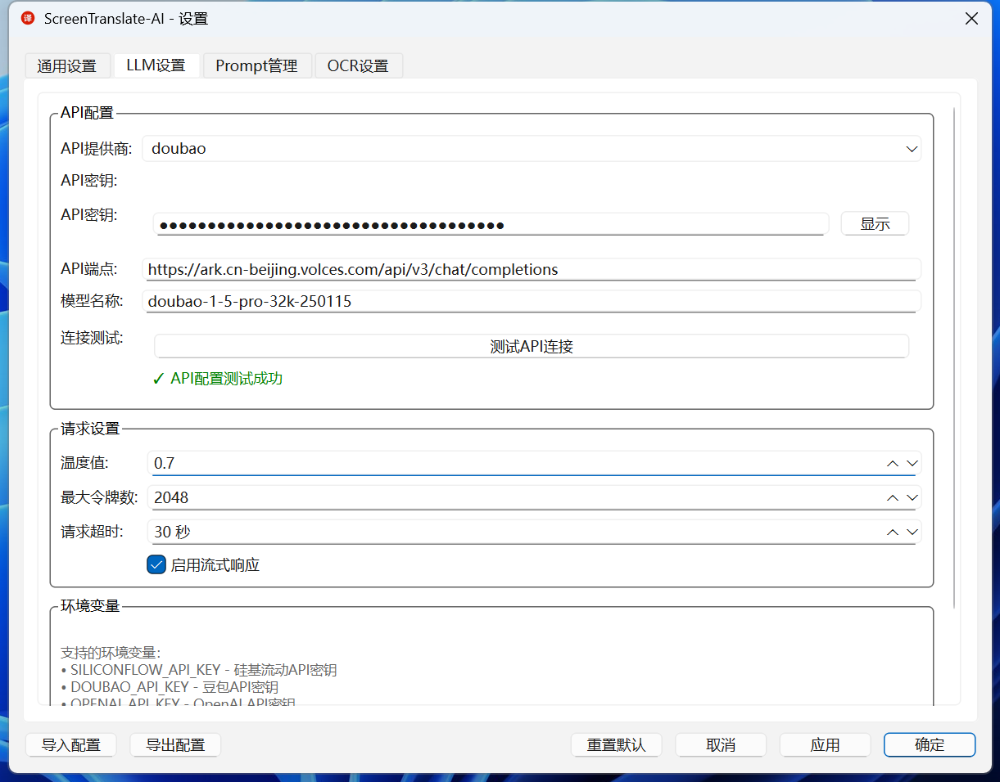
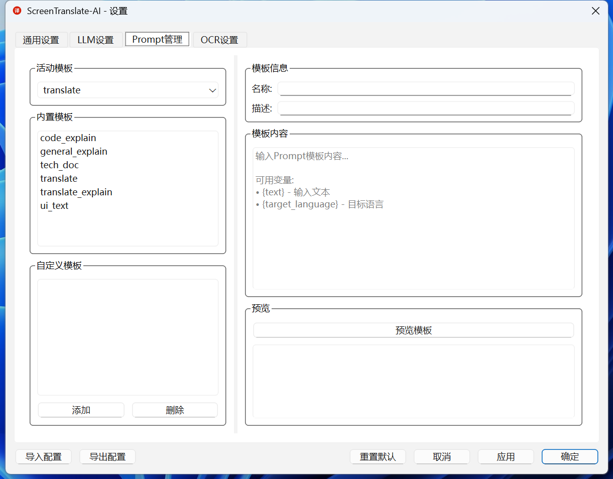
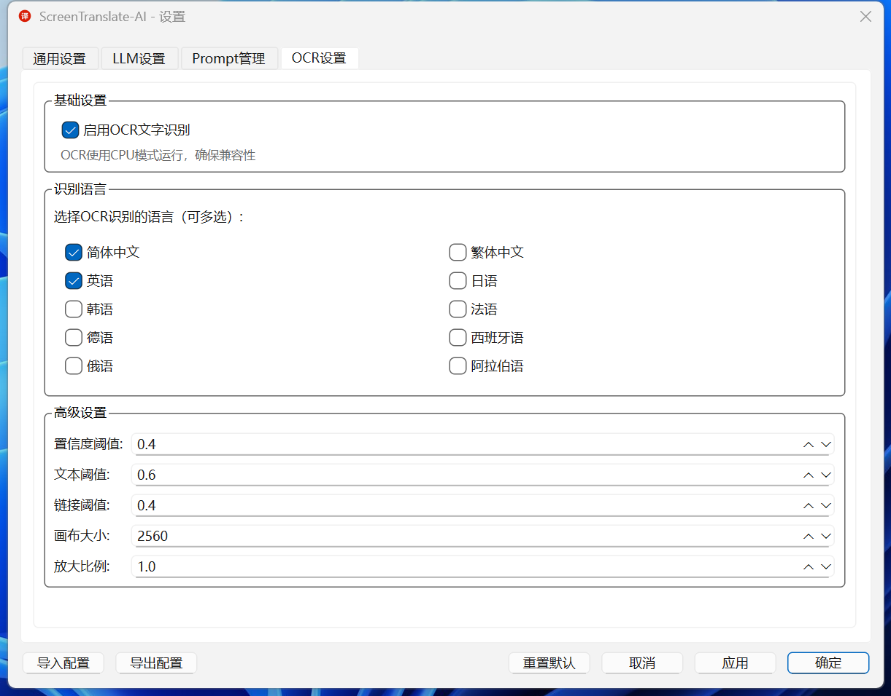
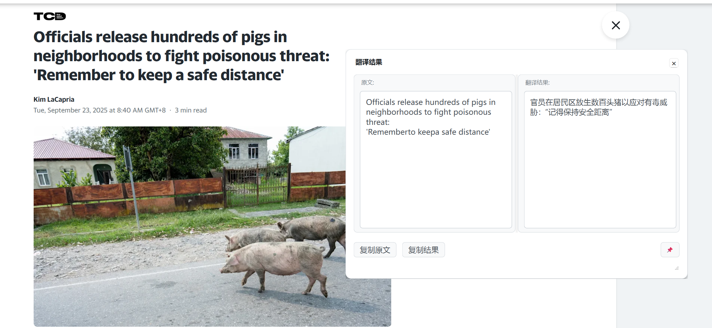
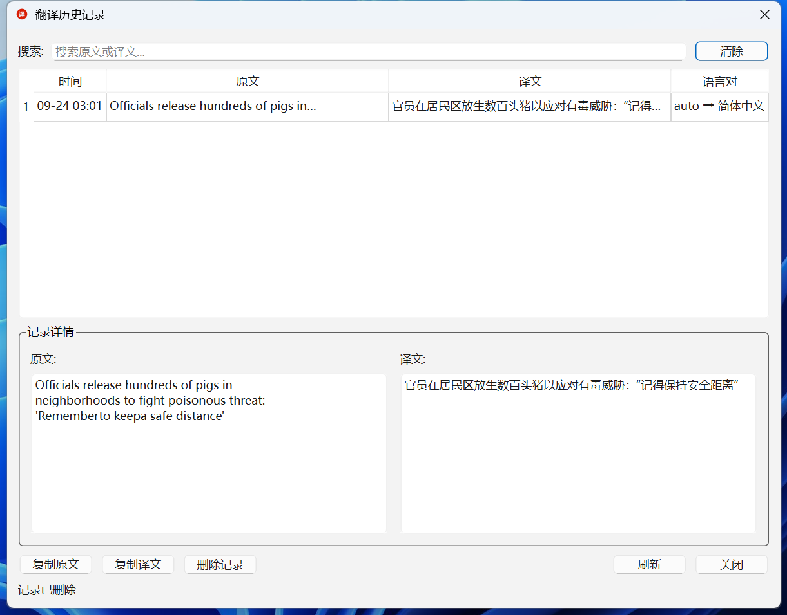

# ScreenTranslate-AI

一款通过截图、OCR和大型语言模型实现屏幕内容即时翻译和解释的桌面效率工具。

## 功能特性

- 🔥 **全局快捷键截图**：Alt+3 一键启动截图翻译
- 🤖 **智能文字识别**：基于 EasyOCR 的多语言 OCR 引擎
- 🌐 **实时翻译**：集成多种 LLM API（OpenAI、SiliconFlow、豆包等）
- 📚 **历史记录管理**：自动保存翻译历史，支持搜索和导出
- 🎨 **现代化界面**：系统托盘应用，结果悬浮窗显示
- 🔧 **高度可配置**：支持语言、模型、热键等自定义配置

## 系统要求

- **操作系统**：Windows 10+、Ubuntu 20.04+、macOS 10.15+
- **Python 版本**：Python 3.8+
- **内存**：建议 4GB 以上
- **磁盘空间**：至少 500MB 可用空间

## 快速开始

### 从源代码运行

```bash
# 1. 克隆项目
git clone https://github.com/Liu-Bot24/ScreenTranslate-AI.git
cd ScreenTranslate-AI

# 2. 创建并激活虚拟环境（Windows 示例）
python -m venv .venv
.venv\Scripts\activate

#   macOS / Linux
# python -m venv .venv
# source .venv/bin/activate

# 3. 安装依赖
pip install -r requirements.txt

# 4. 启动应用程序
python main.py
```

## 配置说明

### API 配置

首次使用需要配置 LLM API 密钥。应用程序启动后：

1. 右键点击系统托盘图标
2. 选择“设置”
3. 在 LLM 配置页输入 API 密钥

支持的 API 提供商：
- **OpenAI**: `https://api.openai.com/v1/chat/completions`
- **SiliconFlow**: `https://api.siliconflow.cn/v1/chat/completions`
- **字节跳动豆包**: `https://ark.cn-beijing.volces.com/api/v3/chat/completions`
- **自定义 API**: 兼容 OpenAI Chat Completions 协议的服务

### 热键配置

默认热键为 `Alt+3`，可在设置中修改为其他组合键。

### OCR 语言

支持多种语言的文字识别：中文（简体/繁体）、英语、日语、韩语、法语、德语、西班牙语、俄语、阿拉伯语等。

## 使用方法

1. **启动应用程序**：执行 `python main.py` 或运行可执行文件
2. **截图翻译**：使用热键 `Alt+3` 或双击托盘图标，框选区域后等待识别与翻译
3. **查看历史**：右键托盘图标 → “历史记录”
4. **调整设置**：右键托盘图标 → “设置”

## 界面预览













## 项目结构

```
ScreenTranslate-AI/
├── main.py                 # 程序入口
├── requirements.txt        # 依赖列表
├── README.md               # 项目说明
├── ico.png                 # 应用图标
├── src/                    # 源代码
│   ├── main.py             # 主程序逻辑
│   ├── config/             # 配置管理
│   ├── core/               # 核心模块（OCR、截图、热键等）
│   ├── ui/                 # 用户界面
│   └── utils/              # 工具组件
├── resources/              # 资源文件
├── data/                   # 运行时数据（如 config.json、history.json）
│   └── history.json        # 翻译历史
└── logs/                   # 运行时日志
```

## 开发指南

### 环境设置

1. 使用 Python 3.8+ 版本
2. 建议在 `.venv` 虚拟环境中开发
3. 安装依赖：`pip install -r requirements.txt`

### 添加新功能

1. 在 `src/` 对应模块中实现功能
2. 如需新增依赖，更新 `requirements.txt`
3. 补充文档与测试

### 代码规范

- 使用 UTF-8 编码
- 遵循 PEP 8
- 建议添加类型注解和文档字符串
- 选择有意义的命名

## 常见问题

### Q: 应用程序无法启动？
A: 确认虚拟环境中依赖是否安装完整，可重新执行 `pip install -r requirements.txt`。

### Q: OCR 识别不准确？
A: 确保截图区域清晰，并尝试调整 OCR 设置或选择合适的语言。

### Q: 热键不工作？
A: 检查热键是否被其他程序占用，可以在设置中更换组合键。

### Q: macOS 需要授权吗？
A: 请在“系统偏好设置 > 安全性与隐私 > 隐私”中授予屏幕录制和辅助功能权限。

### Q: Linux 上界面显示异常？
A: 安装 Qt6 相关库，例如：
```bash
# Ubuntu/Debian
sudo apt install libqt6-core6 libqt6-gui6 libqt6-widgets6

# CentOS/RHEL
sudo yum install qt6-qtbase qt6-qtbase-gui
```

## 许可证

项目采用 MIT 许可证，详见 [LICENSE](LICENSE)。

## 贡献指南

欢迎提交 Issue 和 Pull Request：

1. Fork 本仓库
2. 创建分支 (`git checkout -b feature/AmazingFeature`)
3. 提交更改 (`git commit -m 'Add some AmazingFeature'`)
4. 推送到分支 (`git push origin feature/AmazingFeature`)
5. 发起 Pull Request

## 更新日志

### v1.0.0
- 初始版本发布
- 支持截图 OCR 翻译
- 多平台兼容
- 提供历史记录功能

## 联系方式

- 项目主页：[https://github.com/Liu-Bot24/ScreenTranslate-AI](https://github.com/Liu-Bot24/ScreenTranslate-AI)
- 问题反馈：[Issues](https://github.com/Liu-Bot24/ScreenTranslate-AI/issues)


